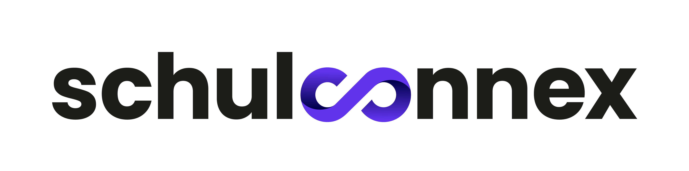

# Schulconnex

<p align="center"></p>

Schulconnex ist ein neuer technischer Schnittstellenstandard (API) für die Bereitstellung und Synchronisation
von Identitäten und deren schulischen Kontextdaten. Schulische Kontextdaten sind zum Beispiel die schulischen Rollen,
Gruppenzugehörigkeiten, Unterrichtsfächer, eine Schulnummer oder Angaben zu Bildungsgängen. Die primären Anwendungsfälle
von Schulconnex sind die Synchronisation von Identitäten und schulischen Kontextdaten von Personen zwischen
Schulverwaltungssystemen und schulischen Identitätsverwaltungssystemen (Schulconnex für Quellsysteme) und die Bereitstellung
von schulischen Kontextdaten von Nutzerinnen und Nutzern für digitale Bildungsmedien (Schulconnex für Dienste).

Weitere Informationen bei der [Landesinitiative n-21](https://www.n-21.de/portal/seiten/moin-schule-900000111-10056.html).

## Lokale Entwicklung

Abhängigkeiten

* Node.js / npm

Installieren der notwendigen NPM-Module:

```bash
npm install
```

### Starten

```bash
npm start
```

Dieser Befehl startet einen lokalen Webserver für die Entwicklung und öffnet einen Webbrowser. Die meisten Änderungen
an den Quellen werden werden sofort sichtbar und benötigen keinen Webserverneustart.

### Kompilieren

```bash
npm build
```

Dieser Befehl erzeugt statische Dateien im Verzeichnis `build`, die von einem Webserver gehostet werden können.

## Lizenz

Der Quellcode sowie die Releases sind lizenziert unter [CC BY-ND 2.0 DE](https://creativecommons.org/licenses/by-nd/2.0/de/legalcode)
