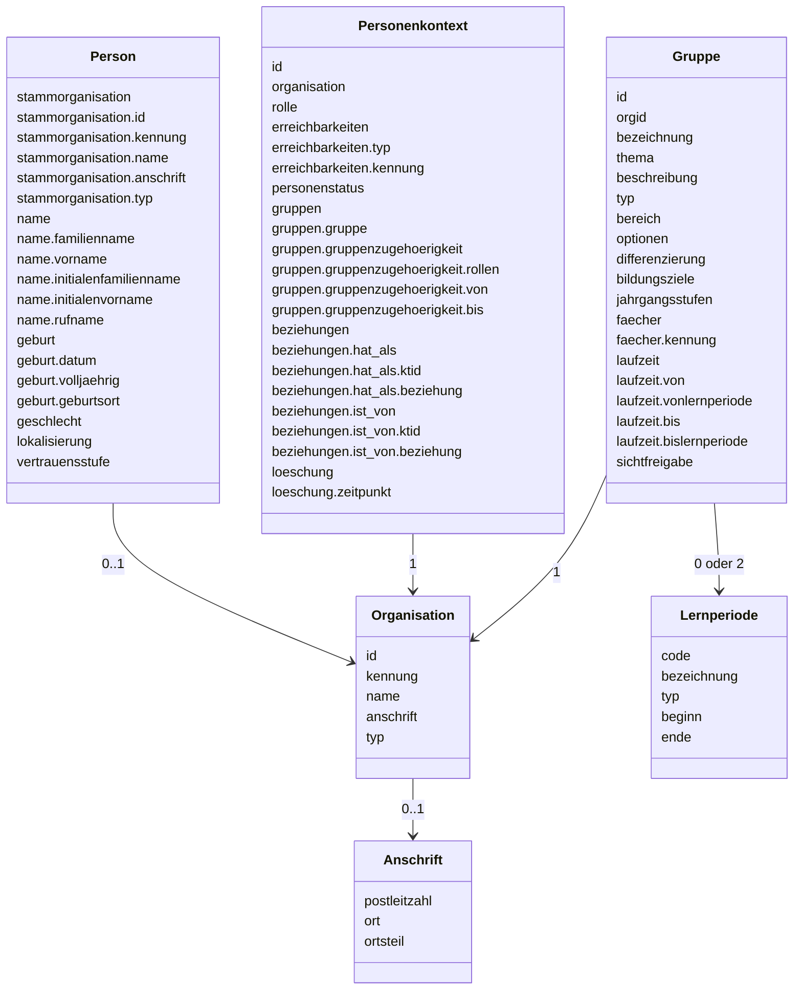

# Angepasstes Datenmodell

Der Datenabruf durch einen Dienst erfolgt im Kontext eines Nutzers oder einer Nutzerin und stellt nur die Daten,
die für die Nutzung des Dienstes erforderlich sind, bereit. Die Daten haben aus diesem Grund eine andere Struktur
als an den Endpunkten für Quellsysteme. Außerdem sind nur lesende Abrufe (`GET`) möglich. Zur Referenzierung
der Daten einer spezifischen Person oder von Personenkontexten wird eine pseudonymisierte ID (`pid`) genutzt,
welche aus Sicht der einzelnen Dienste jeweils konstant und eindeutig ist. Diese pseudonymisierte ID
entspricht nicht notwendig der intern in der Datenhaltung des Schulconnex-Services genutzten ID.
Damit kann ein automatischer direkter Abgleich der Informationen zwischen zwei Anbietern, unter Umgehung
des Schulconnex-Servers, erschwert werden.

Nicht alle Attribute stehen allen Diensten zur Verfügung. Welche Daten vom Schulconnex-Server an den Dienst
geliefert werden, wird durch individuelle Absprachen zwischen Dienstanbieter und Betreiber
des Schulconnex-Servers festgelegt.

## Hinweis zur Notation `0/1`, `0/0..1` und `0/0..n` bei der Anzahl

Bei Attributen mit der Anzahl `0/1` hängt es von der vertraglichen Absprache zwischen Dienstanbieter und
Betreiber des Schulconnex-Servers ab, ob dieses Attribut geliefert wird. Sieht die Absprache
die Bereitstellung dieses Attributes nicht vor, so wird es nie geliefert (d. h. bei nicht erfolgter Freigabe
ist die Anzahl als `0` zu lesen und das Vorhandensein des Attributes ist als Fehler zu interpretieren).

Sieht die Absprache die Bereitstellung dieses Attributes vor, so zeigt die Angabe nach dem Schrägstrich,
ob ein Attribut immer (`0/1`) oder maximal einmal zu erwarten ist (`0/0..1`). Die Schreibweise `0/0..n` zeigt an,
dass kein Wert oder ein Array von Werten zu erwarten sind. Beispielsweise ist nicht für
alle Personen ein Geburtsdatum hinterlegt, so dass, selbst wenn das Attribut `geburt.datum` freigegeben ist,
nicht zwingend ein Geburtsdatum geliefert wird.

:::note[Hinweis]
Die Angabe `0 oder 2` für „Gruppe“ assoziiert mit der Klasse „Lernperiode“ bedeutet, dass eine Gruppe entweder
keine Lernperioden oder genau zwei Lernperioden (`vonlernperiode` und `bislernperiode`) haben kann, siehe auch
[Datenmodell Gruppe Attribut `laufzeit`](./gruppe.md).
:::
