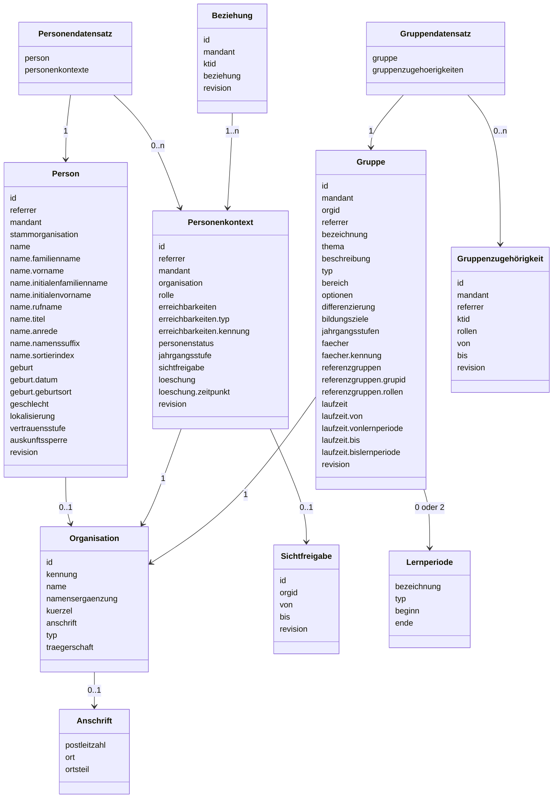

# Datenmodell

Der Begriff Datenmodell steht im Kontext dieser Spezifikationen nicht für das Datenmodell zur Persistierung von Entitäten in einer Datenhaltung. Im Kontext dieser Spezifikation repräsentiert der Begriff die Datenstruktur der Nutzlast von Anfragen (Request Payload) und Nutzlast der Antworten (Response Payload)
bei XHR-Anfragen (HTTP-Anfragen gegen API-Endpunkte).

Das Datenmodell der Schnittstelle basiert auf Datenmodellen der Spezifikationen [XBildung][1] und
[XSchule][2] (bspw. „NatuerlichePerson“ ist die Vorlage für „[Person](./person.md)“, auch „[Organisation](./organisation.md)“ ist an XBildung orientiert), jeweils mit spezifischen Erweiterungen.

:::note[Hinweis]
Die Angabe `0 oder 2` für „Gruppe“ assoziiert mit der Klasse „Lernperiode“ bedeutet, dass eine Gruppe entweder
keine Lernperioden oder genau zwei Lernperioden (`vonlernperiode` und `bislernperiode`) haben kann, siehe auch
[Datenmodell Gruppe Attribut `laufzeit`](./gruppe.md).
:::

## Verwendete Konventionen

###	Optionalität und Anzahl

In den Datenmodellen wird für jedes Attribut die Anzahl des Vorkommens definiert. Attribute mit der
Anzahl `0..1` oder `0..n` sind als optional zu verstehen. Je nach Autorisierung kann bei einer erfolgreichen
HTTP-Anfrage gegen einen API-Endpunkt das minimale Datenmodell ausgegeben werden. Dieses umfasst die Attribute
mit der Mindestanzahl `1`. Beispielsweise kann eine Rückgabe nur das Attribut `id` (identifier) enthalten.

### String

Bei Attributen vom Typ String (Zeichenkette) ist die maximale Länge der Zeichenkette standardmäßig mit
256 Zeichen definiert. Bei Strings, deren maximale Länge davon abweicht, ist die maximale Länge in den
Datenmodellen angegeben. Diese Angabe erfolgt durch Anhang der Maximallänge in Klammern hinter den Datentyp String.
Die Angabe „String (32)“ definiert einen Text mit der maximalen Länge von 32 Zeichen.

[1]: https://www.xrepository.de/details/urn:xoev-de:xbildung-de:def:standard:xbildung
[2]: https://www.xrepository.de/details/urn:xoev-de:xschule-digital:def:standard:xschule
