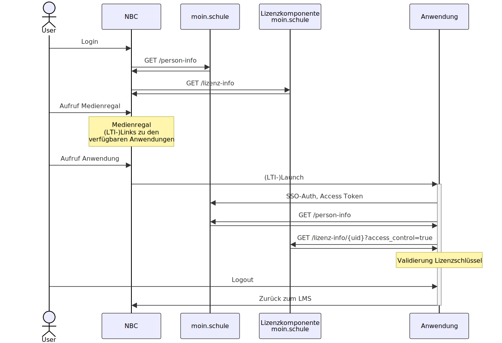

# Ablauf Abruf eines digitalen Inhalts über Zugriffsinfo auf Basis eines Nutzungsrecht

Platzhalter

## Abruf von Nutzungsrechten als Policies

Platzhalter

Sequenz-diagramm für den Abruf von Nutzungsrechten

## Abruf von Zugriffsinfos im Kontext eines Nutzungsrecht

Platzhalter

Sequenz-diagramm für den Abruf von Zugriffsinfos im Kontext eines Nutzungsrecht