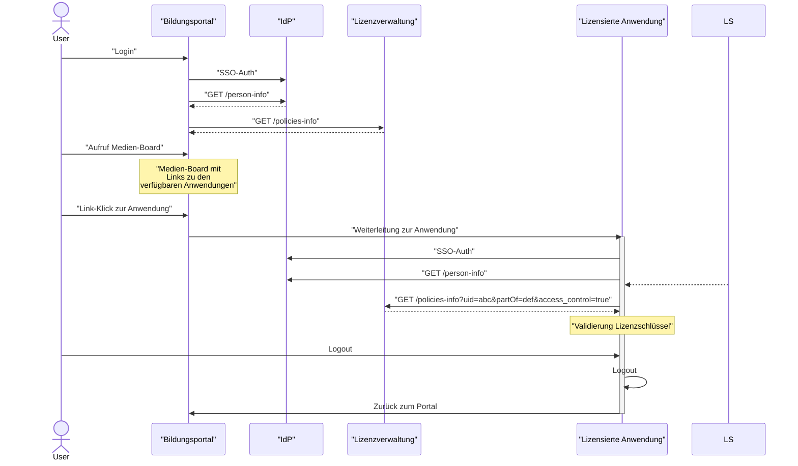

---
tags:
- Informativ
---

# Typischer Aufruf eines lizensierten Mediums

## Abruf von Zugriffsinfos im Kontext eines Nutzungsrechts

Das Diagramm zeigt den Ablauf der Authentifizierungs- und Autorisierungsprozesse bei der Nutzung eines Medienregals mit LTI-Integration. Im Detail werden die einzelnen Schritte wie folgt beschrieben:

### 1. **Login und Benutzerinformationen**
- Der Benutzer meldet sich bei der **Bildungsplattform** (zentrale Plattform) an.
- Die **Bildungsplattform** sendet eine Anfrage (`GET /person-info`), um Benutzerinformationen abzurufen.
- Anschließend wird eine weitere Anfrage (`GET /lizenz-info`) an das **Lizenzsystem** gestellt, um die Lizenzinformationen des Benutzers aus der Lizenzkomponente zu erhalten.

### 2. **Aufruf Medienregal**
- Nach erfolgreicher Authentifizierung zeigt das Medienregal die verfügbaren **LTI-Links** zu den Anwendungen an, die dem Benutzer aufgrund seiner Lizenzen zugänglich sind.

### 3. **Anwendung starten**
- Der Benutzer wählt eine Anwendung aus, wodurch ein **LTI-Launch** ausgelöst wird. Dieser Launch enthält die **uid** der Lizenz.
- Es folgt die **SSO-Authentifizierung** (Single Sign-On), bei der ein **Access-Token** erzeugt wird.
- Ein weiterer API-Aufruf (`GET /person-info`) validiert die Benutzerinformationen.
- Der Aufruf `GET /lizenz-zugriffsinfo/{lizenzInfoUid}` stellt sicher, dass die Lizenz und die zugehörigen Zugriffsrechte überprüft werden.

### 4. **Lizenzvalidierung**
- Die Lizenzkomponente validiert die Gültigkeit des Lizenzschlüssels und die Berechtigungen des Benutzers mithilfe von Zugriffsinformationen.

### 5. **Logout und Rückkehr**
- Nach der Nutzung der Anwendung kann der Benutzer sich abmelden.
- Das System leitet den Benutzer zurück zum LMS.

## Ablaufdiagramm



---

# Schnittstellendefinition

Dieser API-Endpunkt liefert ODRL-basierte Policies für den aktuellen Autorisierungskontext.

Optional können **Zugangsdaten (access control)** zu Medienobjekten und deren Nutzungsrechten angefordert werden.  
Wenn aktiviert, erscheinen diese im Feld **`scx:access_control`**.

Der Endpunkt unterstützt **Content Negotiation** über den `Accept`-Header (JSON oder JSON-LD).

## Request

### Query Parameters

- `target.uid` (string): UID eines spezifischen Medienobjekts (Filter)
- `target.partOf` (string): Name eines spezifischen Medienkatalogs (Filter)
- `access_control` (boolean): Optionaler Einschluss des Access-Control-Objekts (Default: false)

### Header Parameters

- `Accept` (string): `application/json` oder `application/ld+json`  
  Default: `application/json`

  `GET /policies-info?uid=abc&partOf=def&access_control=true`

## Responses

### 200 OK

Beispielstruktur:

```json
{
  "pid": "df6588cf8dc649ef79fcc852e1064761442a32bf3496ecd9bde0f66a18685aaa",
  "data": [
    {
      "policy": {
        "id": "https://example.com/v1/policies-info/9230294b-68da-4f4f-aa63-ad9040122aa7",
        "target": {
          "uid": "urn:issuer:medium:123456789",
          "partOf": "urn:issuer:catalogue"
        },
        "permission": [
          {
            "action": ["execute"]
          }
        ]
      },
      "access_control": {
        "type": "license_key",
        "value": {
          "licenseKey": "5f49ff7f-76a6-4d8b-ae40-e1aba0d57f21"
        }
      }
    }
  ]
}
```

