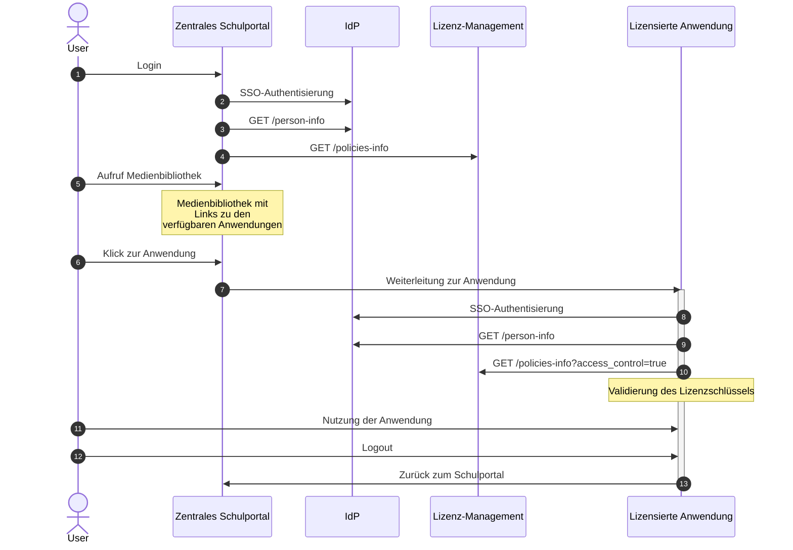

---
tags:
- Informativ
---

# Typischer Aufruf einer lizensierten Anwendung

Dieser Praxisleitfaden beschreibt den typischen Ablauf beim Aufruf einer lizensierten Anwendung über die Medienbibliothek eines zentralen Schulportals. 

## Systemkomponenten 

Folgende Systemkomponenten spielen bei dem Aufruf zusammen: 

- Ein **zentrales Schulportal**, aus dem heraus der Aufruf ausgelöst wird. Dabei könnte es sich um ein klassisches Server-Portal oder auch um eine Lernplattform handeln. Das zentrale Schulportal stellt eine **Medienbibliothek** als graphische Komponente bereit, in welcher alle verfügbaren Medien (in der Regel mit Titel, Logo und Beschreibung) dargestellt sind und per Browserklick aufgerufen werden können. 
- Ein **Identitätsdienst (IdP)** mit **Single-Sign-on (SSO)**, in welchem die Benutzerdaten zentral verwaltet werden.
- Ein **Lizenz-Management**, mit welchem die verantwortlichen Personen einer Schule (Administratoren, Medienbeauftragte) erworbene Lizenzen den Schüler/-innen, Lehrkräften und Lerngruppen zuweisen können.  
- Eine **lizensierte Anwendung**, beispielsweise ein digitales Schulbuch (E-Book). 

## Ablauf

Das folgende Diagramm zeigt den Gesamtablauf inkl. Authentisierung am Identitätsdienst (IdP) mit Single-Sign-on. 

---

---

Der Aufruf der lizensierten Anwendung wird in der Regel im Browser durch eine/-n Schüler/-in oder eine Lehrkraft (User) bei der Interaktion mit dem zentralen Schulportal ausgelöst. 

- Der User loggt sich beim Schulportal ein und dieses ruft die schulbezogenen Personendaten über `/person-info` ab (1-3).
- Das Schulportal ruft über die Nutzungsrechte-API eine Liste aller verfügbaren Anwendungen ab, die im Kontext des User nutzbar sind (4).
- Der User nutzt die Medienbibliothek, um per Browserklick zu der gewünschten Anwendung zu gelangen (5-7). 
- Das System der Anwendung nutzt das SSO und ruft ebenfalls die benötigten schulbezogenen Personendaten ab (8-9). 
- Das System der Anwendung ruft den Lizenschlüssel der gewünschten Anwendung ab (10).
- Der User nutzt die Anwendung bis zum Logout und kehrt zum zentralen Schulportal zurück (11-13). 

## Aufrufe der Nutzungsrechte-API

### Abruf der verfügbaren Anwendungen

Beim Abruf der verfügbaren Anwendungen gibt die Nutzungsrechte-API sämtliche Anwendungen zurück, die im Kontext des angemeldeten Personenkontexts oder der angemeldeten Person zur Verfügung stehen. Mit diesen Information werden wird die graphische Oberfläche der Medienbibliothek passgenau ausschließlich mit Links zu denjenigen Anwendungen befüllt, die auch tatsächlich nutzbar sind. 

#### Request

```
GET /v1/policies-info
```

#### Response

```json
{
  "pid": "df6588cf8dc649ef79fcc852e1064761442a32bf3496ecd9bde0f66a18685aaa",
  "data": [
    {
      "policy": {
        "id": "https://example.com/v1/policies-info/9230294b-68da-4f4f-aa63-ad9040122aa7",
        "target": {
          "uid": "urn:issuer:medium:12345",
          "partOf": "urn:issuer:catalogue"
        },
        "permission": [
          {
            "action": ["execute"]
          }
        ]
      }
    },
    {
      "policy": {
        "id": "https://example.com/v1/policies-info/9230294b-68da-4f4f-aa63-ad9040123bc4",
        "target": {
          "uid": "urn:issuer:medium:67890",
          "partOf": "urn:issuer:catalogue"
        },
        "permission": [
          {
            "action": ["execute"]
          }
        ]
      }
    },
    {
      "policy": {
        "id": "https://example.com/v1/policies-info/9230294b-68da-4f4f-aa63-ad90401211e9",
        "target": {
          "uid": "urn:issuer:medium:abcde",
          "partOf": "urn:issuer2:catalogue"
        },
        "permission": [
          {
            "action": ["execute"]
          }
        ]
      }
    }
  ]
}
```

### Abruf des Lizenzschlüssels für die lizensierte Anwendung

Beim Abruf des Lizenzschlüssels für die aufgerufene lizensierte Anwendung ruft der Anbieter ausschließlich das Nutzungsrecht für die aufgerufene Anwendung samt Lizenzschlüssel ab. Er erwartet bei der Rückgabe von `/policies-info` einen Array mit nur einem Objekt. 

#### Request

```
GET /v1/policies-info?target.uid=urn:issuer:medium:123456789&target.partOf=urn:issuer:catalogue
&access_control=true
```

- `access_control=true`: Anforderung des Lizenzschlüssels
- `target.uid=urn:issuer:medium:12345`: Die Medien-ID der Anwendung 
- `target.partOf=urn:issuer:catalogue`: Die ID des Medienkatalogs, zu dem die Medien-ID gehört

#### Response

```json
{
  "pid": "df6588cf8dc649ef79fcc852e1064761442a32bf3496ecd9bde0f66a18685aaa",
  "data": [
    {
      "policy": {
        "id": "https://example.com/v1/policies-info/9230294b-68da-4f4f-aa63-ad9040122aa7",
        "target": {
          "uid": "urn:issuer:medium:12345",
          "partOf": "urn:issuer:catalogue"
        },
        "permission": [
          {
            "action": ["execute"]
          }
        ]
      },
      "access_control": {
        "type": "license_key",
        "value": {
          "licenseKey": "5f49ff7f-76a6-4d8b-ae40-e1aba0d57f21"
        }
      }
    }
  ]
}
```

