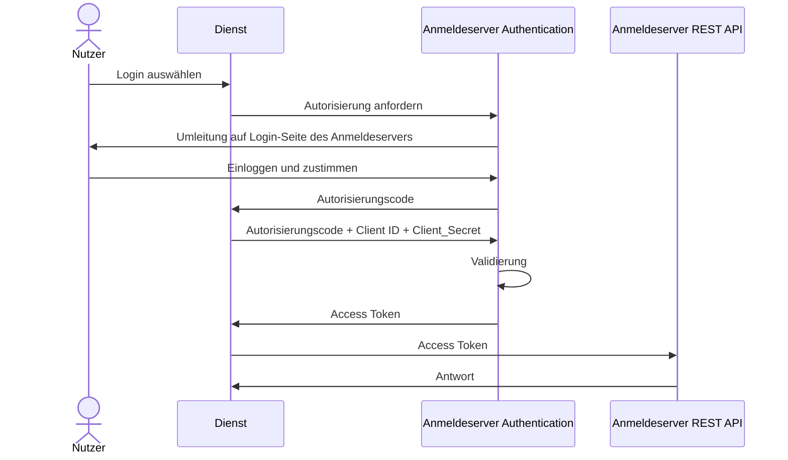

# API-Autorisierung und Authentifikation bei Dienstanbietern

Die Autorisierung entspricht dem Standard OAuth-Modell und ist im folgenden Sequenz-Diagramm
dargestellt. Danach werden die beiden Attribut-Listen „Access Token“ basierend auf der
Spezifikation [OAuth 2.0 Authorization Framework][1] sowie „ID Token“ gemäß der Spezifikation
[OpenID Connect 1.0][2] definiert, jeweils mit spezifischen Anpassungen.

Für die Nutzung der in diesem Dokument spezifizierten Schnittstellenendpunkte (REST-APIs) des
Schulconnex-Servers ist ein Access Token notwendig. Dieser wird von einem separaten
Authentication-Dienst ausgestellt. Den konkreten Endpunkt des Authentication-Dienstes
erhalten Sie vom Betreiber des Schulconnex-Servers.

Für die Autorisierung eines Dienstes und die Authentifikation einer nutzenden Person gegenüber
der REST-API wird das OAuth 2.0 Protokoll verwendet. Gemäß der Spezifikation [IETF RFC 6749][1]
„The OAuth 2.0 Authorization Framework” muss der REST-API-Endpunkt für den „OAuth 2.0 Token Exchange“
(siehe [IETF RFC 8693][3] ”OAuth 2.0 Token Exchange”) genutzt werden. Über die Schnittstelle wird
einer Client-Anwendung im Erfolgsfall ein JSON mit Token ausgestellt; dieser beinhaltet unter
anderem die Autorisierung eines Dienstes (den OAuth `access_token`).

[1]: https://datatracker.ietf.org/doc/html/rfc6749
[2]: https://openid.net/specs/openid-connect-core-1_0.html
[3]: https://datatracker.ietf.org/doc/html/rfc8693

Die Attribute für den erfolgreichen OAuth 2.0 Token Exchange sind im Unterkapitel
„[Access Token](./autorisierung-dienste.md#access-token)“ definiert. Bei dem `access_token`
handelt es sich um eine Zugriffsberechtigung in Form einer Zeichenkette, welche von den
Client-Anwendungen bei den darauffolgenden HTTP-Anfragen gegen die REST-API im Authorization
Header verwendet wird (siehe Attribut `token_type`); dies ist in [IETF RFC 6750][4]
„The OAuth 2.0 Authorization Framework: Bearer Token Usage“ spezifiziert.

[4]: https://datatracker.ietf.org/doc/html/rfc6750

Das ID Token führt unter anderem das Attribut `sub` (kurz für subject identifier). Der Wert des
Attributs `sub` entspricht einer für die Client-Anwendung pseudonymisierten ID `pid` der angemeldeten
nutzenden Person im gewählten Sicherheitskontext. Das Datenmodell für den `id_token` ist im
Unterkapitel „[ID Token](./autorisierung-dienste.md#id-token)“ beschrieben.

Dieser ID Token wird bei der Autorisierung eines Dienstes im Sicherheitskontext einer angemeldeten
Nutzerperson ([OAuth 2.0 Authorization Code Grant][5]) ausgestellt und als Attribut `id_token` im JSON
der erfolgreichen OAuth 2.0 Token Exchange Anfrage geführt. Der für die Client-Anwendung pseudonymisierte
Identifier (Id) der nutzenden Person beschreibt die Person im Sicherheitskontext der Anmeldung und ist
als Attribut `sub` im `id_token` enthalten.

[5]: https://datatracker.ietf.org/doc/html/rfc6749#section-1.3.1

In einigen Fällen ist es für Dienstanbieter wünschenswert, neben der PID bereits bei der
Autorisierung weitere Informationen über die angemeldete Person zu erhalten. Dieses kann, nach
Absprache mit dem Betreiber des Schulconnex-Servers, durch die Nutzung von OIDC Claims geschehen.
Die Nutzung von OIDC Claims zur Übermittlung von Schulconnex-Informationen ist in Kapitel
„[Person-Info über OIDC Claims](./oidc-claims.md)“ beschrieben. Im Regelfall sollten
aber die REST-APIs zur Abfrage von Informationen genutzt werden.

Für darauffolgende Anfragen der Client-Anwendungen gegen einen API-Endpunkt des Schulconnex-Services
muss der `access_token` als Authorization Header im XMLHttpRequest (XHR) verwendet werden.
Das Attribut `token_type` beim OAuth 2.0 Token Exchange Request referenziert die Art der Verwendung
des `access_token` – gemäß IETF RFC 6750 „The OAuth 2.0 Authorization Framework: Bearer Token Usage“ oder
den [Basic][6] und [Digest][7] Authentifizierungsschemata.

[6]: https://www.rfc-editor.org/rfc/rfc7617
[7]: https://www.rfc-editor.org/rfc/rfc7616

Im Kontext der Spezifikation OpenID Connect muss das Attribut `token_type` den Wert `"Bearer"` führen.

## Access Token

Die folgende Tabelle beschreibt die Attribute für die JSON-Antwort einer OAuth
2.0-Token-Exchange-Anfrage. Diese JSON-Struktur beinhaltet unter anderem die Autorisierung
eines Dienstangebots (den OAuth `access_token`) und die Authentifikation einer nutzenden Person
(den OpenID Connect `id_token`). Beim Berechtigungstyp „[OAuth 2.0 Client Credentials Grant][8]“
wird vom Dienst ein Zugriffstoken (`access_token`) außerhalb des Sicherheitskontexts einer
angemeldeten nutzenden Person angefordert. In diesem Fall wird kein `id_token` ausgestellt.
Basierend auf der Spezifikation OAuth 2.0 ist der Antwort-Typ eines OAuth 2.0 Token Exchange
ein JSON-Dokument (HTTP ContentType `application/json`), welches der
[IETF RFC8693][9]-Spezifikation entspricht.

[8]: https://datatracker.ietf.org/doc/html/rfc6749#section-4.4
[9]: https://datatracker.ietf.org/doc/html/rfc8693

Attribut Ebene 0 | Typ | Anzahl | Bemerkung
--- | --- | --- | ---
access_token | String (byte) | 1 | Ein Token (`access_token`), welches vom Service auf die OAuth 2.0-Token-Exchange-Anfrage im Erfolgsfall ausgestellt wurde. Dieses ausgestellte `access_token` des zugrunde liegenden Authorization Frameworks ist spezifiziert in [IETF RFC6749][10] Abschnitt 5.1 .
expires_in | Integer | 0..1 | Die Gültigkeit des Tokens (`access_token`) in Sekunden ab Ausstellung. Das `access_token` beinhaltet ebenfalls die Dauer der Gültigkeit des Tokens. Dieser Wert ist *optional*, sofern ein `access_token` ausgestellt wurde. Beispielhaft steht der Wert 1800 für eine Gültigkeitsdauer von 30 Minuten.
refresh_token | String (byte) | 0..1 | Ein Token (`refresh_token`), welches vom Schulconnex-Server auf die OAuth 2.0-Token-Exchange-Anfrage im Erfolgsfall *optional* ausgestellt wurde. Mit dem `refresh_token` kann beim Schulconnex-Server ein neues `access_token` angefordert werden.
token_type | String (Enumerated) | 0..1 | Der `token_type` stellt die Information zur Verfügung, wie das `access_token` angewendet werden kann. Auswahl an `token_type`: <ul><li>[bearer][11]</li><li>[mac][12]</li></ul> Im Kontext der Spezifikation OpenID Connect *muss* das Attribut `token_type` den Wert `"Bearer"` führen.
id_token | String (byte) | 0..1 | Basierend auf der Spezifikation OpenID Connect beinhaltet die Token-Antwort einer OAuth 2.0-Token-Exchange-Anfrage zusätzlich ein Token ([`id_token`][13]), welches Informationen über die Authentifizierung einer nutzenden Person beinhaltet. Siehe „[ID Token](./autorisierung-dienste.md#id-token)“.
scope | String (byte) | 0..1 | Eine Liste von durch Leerzeichen getrennten Zeichenketten, die den [Geltungsbereich des Tokens][14] spezifiziert.

[10]: https://datatracker.ietf.org/doc/html/rfc6749#section-5.1
[11]: https://datatracker.ietf.org/doc/html/rfc6750
[12]: https://datatracker.ietf.org/doc/html/rfc6749#ref-OAuth-HTTP-MAC
[13]: https://openid.net/specs/openid-connect-core-1_0.html#CodeIDToken
[14]: https://datatracker.ietf.org/doc/html/rfc6749#section-3.3

## ID Token

Die folgende Tabelle beschreibt die Attribute für eine authentifizierte nutzende Person in Form
eines sogenannten OpenID Connect ID-Tokens. Bei dem `id_token` handelt es sich um ein
[JSON Web Token (JWT)][15]. Von Interesse für Dienstanbieter ist das Attribut `sub` (subject identifier).
Bei dieser Zeichenkette handelt es sich um einen Identifier, welcher der authentifizierten
nutzenden Person in dessen Sicherheitskontext und anfragenden Dienst nach der OpenID-Connect-Spezifikation
als Subject-Identifier-Typ „pairwise“ zugeordnet ist (siehe Spezifikation [OpenID Connect 1.0][16]
Kapitel 8.0 „Subject Identifier Type” und Kapitel 8.1 „Pairwise Identifier Algorithm” der
Spezifikation OpenID Connect 1.0).

[15]: https://www.rfc-editor.org/rfc/rfc7519
[16]: https://openid.net/specs/openid-connect-core-1_0.html

Attribut Ebene 0 | Typ | Anzahl | Bemerkung
--- | --- | --- | ---
iss | String (byte) | 1 | Der issuer identifier ist eine URL, welche denjenigen identifiziert, der die Inhalte herausgegeben hat.
sub | String (byte) | 1 | Der subject identifier ist eine Zeichenkette mit einer maximalen Länge von 255 ASCII-Zeichen und repräsentiert, wer lokal das Token nutzt.
aud | String (byte) | 1 | Die audience (`aud`) claim listet die erwarteten Empfängerinnen und Empfänger des JWT auf. Im Falle eines ID-Tokens enthält aud die Client-ID der Client-Anwendung, welche den ID-Token angefordert hat.
exp | Integer | 1 | Das Attribut `exp` (expires) führt das Datum, bis wann das JWT Gültigkeit hat. Das Datum wird als Unix-Epoch-Time geführt und ist ein Integer, welcher die Sekunden seit dem 01. Januar 1970 angibt.
iat | Integer | 1 | Das Attribut `iat` (issued at) führt das Datum, zu welchem Zeitpunkt das JWT ausgestellt wurde. Das Datum wird als Unix-Epoch-Time geführt und ist ein Integer, welcher die Sekunden seit dem 01. Januar 1970 angibt.
auth_time | Integer | 0..1 | Das optionale Attribut `auth_time` führt das Datum, zu welchem Zeitpunkt die nutzende Person authentifiziert wurde. Das Datum wird als Unix-Epoch-Time geführt und ist ein Integer, welcher die Sekunden seit dem 01. Januar 1970 angibt.
nonce | String (byte) | 0..1 | ID-Token können mit dem Attribut `nonce` ausgestellt werden, um Attacken zu verhindern. Das optionale Attribut wird geführt, sofern dieses bei der Ausstellung angefordert wurde und der Schulconnex-Service diesen entsprechend zum Abgleich vorhält.
acr | String (byte) | 0..1 | Das optionale Attribut `acr` (Authentication Context Class Reference) referenziert die URI der [Benutzerauthentifizierungsmethode][17], welche erfüllt wurde.
amr | String (byte) | 0..1 | Das optionale Attribut `amr` (Authentication Method Reference) referenziert die Methode der [Benutzerauthentifizierung][18], welche verwendet wurde.
azp | String (byte) | 0..1 | Das optionale Attribut `azp` (Authorized Party) führt die Client-ID der autorisierten Anwendung; es handelt sich um die Client-ID des Clients, welche den ID-Token angefordert hat.

[17]: https://openid.net/specs/openid-provider-authentication-policy-extension-1_0.html
[18]: https://datatracker.ietf.org/doc/html/rfc8176
